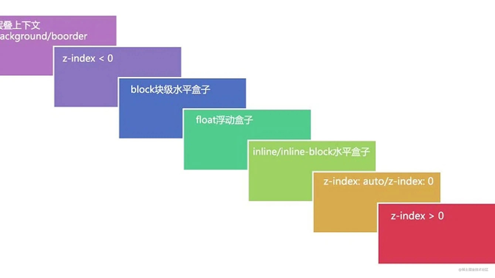

# 层叠上下文

[官网]: https://developer.mozilla.org/zh-CN/docs/Web/CSS/CSS_Positioning/Understanding_z_index/The_stacking_context

我们假定用户正面向（浏览器）视窗或网页，而 HTML 元素沿着其相对于用户的一条虚构的 z 轴排开，**层叠上下文**就是对这些 HTML 元素的一个三维构想。众 HTML 元素基于其元素属性按照优先级顺序占据这个空间。

**产生层叠上下文的元素其子元素将无法穿透父元素（永远在父元素之上）**。

**备注：** 层叠上下文的层级是 HTML 元素层级的一个子级，因为只有某些元素才会创建层叠上下文。可以这样说，没有创建自己的层叠上下文的元素会被父层叠上下文*同化*。

以下是默认层级排放图：

