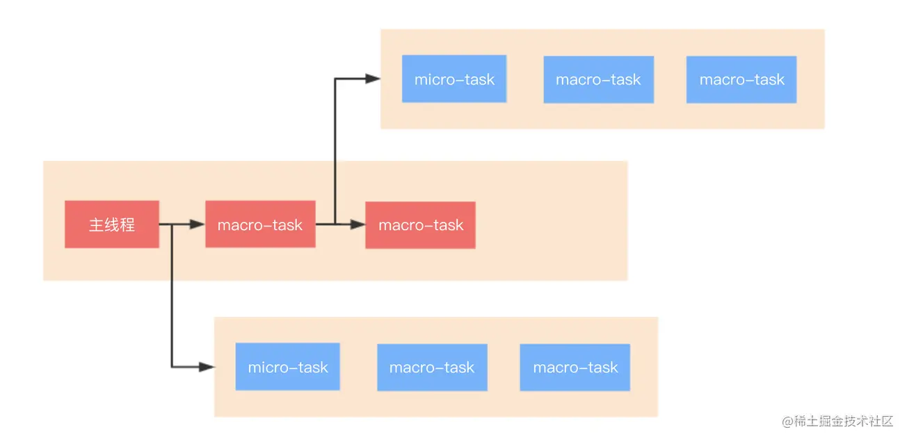

[事件循环](https://juejin.cn/post/6844904079353708557)

## Event loop

JavaScript代码的执行过程中，除了依靠函数调用栈来搞定函数的执行顺序外，还依靠任务队列(task queue)来搞定另外一些代码的执行。整个执行过程，我们称为事件循环过程。一个线程中，事件循环是唯一的，但是任务队列可以拥有多个。任务队列又分为macro-task（宏任务）与micro-task（微任务），在最新标准中，它们被分别称为task与jobs。

macro-task大概包括：

- script(整体代码)
- setTimeout
- setInterval
- setImmediate
- I/O
- UI render

micro-task大概包括:

- process.nextTick
- Promise.then
- Async/Await(实际就是promise)
- MutationObserver(html5新特性)



总的结论就是，执行宏任务，然后执行该宏任务产生的微任务，若微任务在执行过程中产生了新的微任务，则继续执行微任务，微任务执行完毕后，再回到宏任务中进行下一轮循环。

### async/await执行顺序

遇到await，会等后面的函数执行完成后产生一个微任务，此时将会保留async函数的上下文，然后跳出async函数，在执行完其他代码后才把这个微任务（async函数上下文）推入微任务栈里面。

```
console.log('script start')

async function async1() {
await async2()
console.log('async1 end')
}
async function async2() {
console.log('async2 end')
}
async1()

setTimeout(function() {
console.log('setTimeout')
}, 0)

new Promise(resolve => {
console.log('Promise')
resolve()
})
.then(function() {
console.log('promise1')
})
.then(function() {
console.log('promise2')
})

console.log('script end')
// 旧版输出如下，但是请继续看完本文下面的注意那里，新版有改动
// script start => async2 end => Promise => script end => promise1 => promise2 => async1 end => setTimeout
// 新版的chrome浏览器中不是如上打印的，因为chrome优化了,await变得更快了,输出为:
// script start => async2 end => Promise => script end => async1 end => promise1 => promise2 => setTimeout
```

