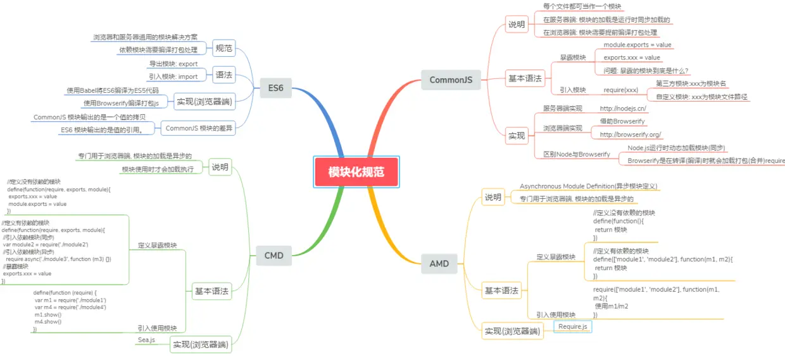

# 前端模块化

[前端模块化](https://segmentfault.com/a/1190000017466120)

## 前端模块化的理解




### 什么是模块

- 将一个复杂的程序依据一定的规则(规范)封装成几个块(文件), 并进行组合在一起
- 块的内部数据与实现是私有的, 只是向外部暴露一些接口(方法)与外部其它模块通信

### 模块化的进化过程

**全局function模式 : 将不同的功能封装成不同的全局函数**

- 编码: 将不同的功能封装成不同的全局函数
- 问题: 污染全局命名空间, 容易引起命名冲突或数据不安全，而且模块成员之间看不出直接关系

```js
function m1(){
  //...
}
function m2(){
  //...
}
```

- **namespace模式 : 简单对象封装**
  - 作用: 减少了全局变量，解决命名冲突
  - 问题: 数据不安全(外部可以直接修改模块内部的数据)

```javascript
let myModule = {
  data: 'www.baidu.com',
  foo() {
    console.log(`foo() ${this.data}`)
  },
  bar() {
    console.log(`bar() ${this.data}`)
  }
}
myModule.data = 'other data' //能直接修改模块内部的数据
myModule.foo() // foo() other data
```

这样的写法会暴露所有模块成员，内部状态可以被外部改写。

- **IIFE模式：匿名函数自调用(闭包)**
  - 作用: 数据是私有的, 外部只能通过暴露的方法操作
  - 编码: 将数据和行为封装到一个函数内部, 通过给window添加属性来向外暴露接口
  - 问题: 如果当前这个模块依赖另一个模块怎么办?

```xml
// index.html文件
<script type="text/javascript" src="module.js"></script>
<script type="text/javascript">
    myModule.foo()
    myModule.bar()
    console.log(myModule.data) //undefined 不能访问模块内部数据
    myModule.data = 'xxxx' //不是修改的模块内部的data
    myModule.foo() //没有改变
</script>
```

```javascript
// module.js文件
(function(window) {
  let data = 'www.baidu.com'
  //操作数据的函数
  function foo() {
    //用于暴露有函数
    console.log(`foo() ${data}`)
  }
  function bar() {
    //用于暴露有函数
    console.log(`bar() ${data}`)
    otherFun() //内部调用
  }
  function otherFun() {
    //内部私有的函数
    console.log('otherFun()')
  }
  //暴露行为
  window.myModule = { foo, bar } //ES6写法
})(window)
```

- **IIFE模式增强 : 引入依赖**

```javascript
// module.js文件
(function(window, $) {
  let data = 'www.baidu.com'
  //操作数据的函数
  function foo() {
    //用于暴露有函数
    console.log(`foo() ${data}`)
    $('body').css('background', 'red')
  }
  function bar() {
    //用于暴露有函数
    console.log(`bar() ${data}`)
    otherFun() //内部调用
  }
  function otherFun() {
    //内部私有的函数
    console.log('otherFun()')
  }
  //暴露行为
  window.myModule = { foo, bar }
})(window, jQuery)
```

```xml
 // index.html文件
  <!-- 引入的js必须有一定顺序 -->
  <script type="text/javascript" src="jquery-1.10.1.js"></script>
  <script type="text/javascript" src="module.js"></script>
  <script type="text/javascript">
    myModule.foo()
  </script>
```

上例子通过jquery方法将页面的背景颜色改成红色，所以必须先引入jQuery库，就把这个库当作参数传入。**这样做除了保证模块的独立性，还使得模块之间的依赖关系变得明显**。

### 模块化的好处

- 避免命名冲突(减少命名空间污染)
- 更好的分离, 按需加载
- 更高复用性
- 高可维护性

### 引入多个`<script>`后出现出现问题

- 请求过多

首先我们要依赖多个模块，那样就会发送多个请求，导致请求过多

- 依赖模糊

我们不知道他们的具体依赖关系是什么，也就是说很容易因为不了解他们之间的依赖关系导致加载先后顺序出错。

- 难以维护

以上两种原因就导致了很难维护，很可能出现牵一发而动全身的情况导致项目出现严重的问题。
模块化固然有多个好处，然而一个页面需要引入多个js文件，就会出现以上这些问题。而这些问题可以通过模块化规范来解决，下面介绍开发中最流行的commonjs, AMD, ES6, CMD规范。

## 模块化规范

### CommonJS

#### 概述

Node 应用由模块组成，采用 CommonJS 模块规范。每个文件就是一个模块，有自己的作用域。在一个文件里面定义的变量、函数、类，都是私有的，对其他文件不可见。**在服务器端，模块的加载是运行时同步加载的；在浏览器端，模块需要提前编译打包处理。**

#### 特点

- 所有代码都运行在模块作用域，不会污染全局作用域。
- 模块可以多次加载，但是只会在第一次加载时运行一次，然后运行结果就被缓存了，以后再加载，就直接读取缓存结果。要想让模块再次运行，必须清除缓存。
- 模块加载的顺序，按照其在代码中出现的顺序。

#### 基本语法

- 暴露模块：`module.exports = value`或`exports.xxx = value`
- 引入模块：`require(xxx)`,如果是第三方模块，xxx为模块名；如果是自定义模块，xxx为模块文件路径

此处我们有个疑问：**CommonJS暴露的模块到底是什么?** CommonJS规范规定，每个模块内部，module变量代表当前模块。这个变量是一个对象，它的exports属性（即module.exports）是对外的接口。**加载某个模块，其实是加载该模块的module.exports属性**。

```js
// example.js
var x = 5;
var addX = function (value) {
  return value + x;
};
module.exports.x = x;
module.exports.addX = addX;
```

上面代码通过module.exports输出变量x和函数addX。

```js
var example = require('./example.js');//如果参数字符串以“./”开头，则表示加载的是一个位于相对路径
console.log(example.x); // 5
console.log(example.addX(1)); // 6
```

require命令用于加载模块文件。**require命令的基本功能是，读入并执行一个JavaScript文件，然后返回该模块的exports对象。如果没有发现指定模块，会报错**。

#### 模块的加载机制

**CommonJS模块的加载机制是，输入的是被输出的值的拷贝。也就是说，一旦输出一个值，模块内部的变化就影响不到这个值**。这点与ES6模块化有重大差异（下文会介绍），请看下面这个例子：

```js
// lib.js
var counter = 3;
function incCounter() {
  counter++;
}
module.exports = {
  counter: counter,
  incCounter: incCounter,
};
```

上面代码输出内部变量counter和改写这个变量的内部方法incCounter。

```js
// main.js
var counter = require('./lib').counter;
var incCounter = require('./lib').incCounter;

console.log(counter);  // 3
incCounter();
console.log(counter); // 3
```

上面代码说明，counter输出以后，lib.js模块内部的变化就影响不到counter了。**这是因为counter是一个原始类型的值，会被缓存。除非写成一个函数，才能得到内部变动后的值**。

#### 服务器端实现

node默认支持。

#### 浏览器端实现

browserify

