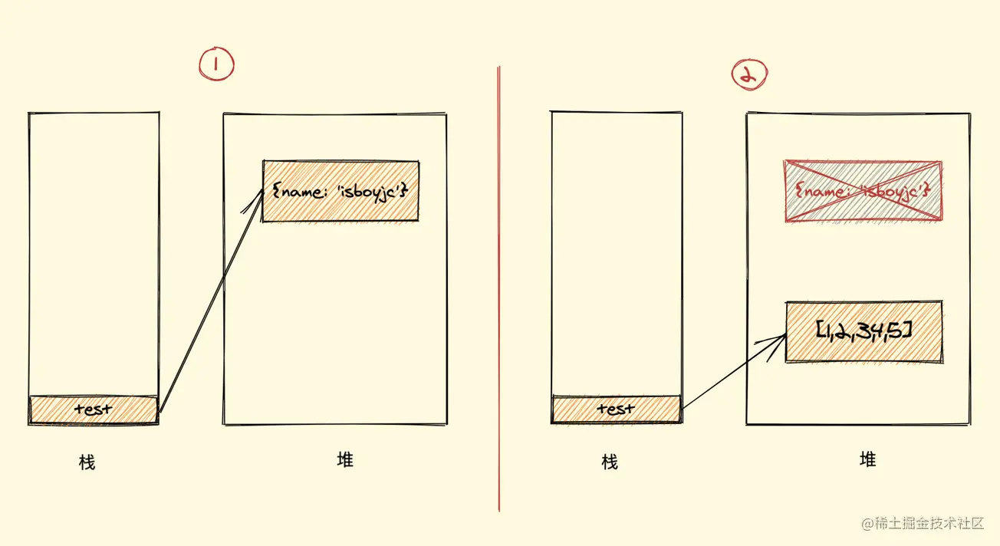

[垃圾回收机制](https://juejin.cn/post/6981588276356317214)

## 垃圾产生原因

`JavaScript` 的引用数据类型是保存在堆内存中的，然后在栈内存中保存一个对堆内存中实际对象的引用，所以，`JavaScript` 中对引用数据类型的操作都是操作对象的引用而不是实际的对象。可以简单理解为，栈内存中保存了一个地址，这个地址和堆内存中的实际值是相关的。

```js
let test = {
  name: "isboyjc"
};
test = [1,2,3,4,5]
```



没有了引用关系，也就是无用的对象，这个时候假如任由它搁置，一个两个还好，多了的话内存也会受不了，所以就需要被清理（回收）。

## 垃圾回收策略

`JavaScript` 垃圾回收机制的原理说白了也就是定期找出那些不再用到的内存（变量），然后释放其内存

这个流程就涉及到了一些算法策略，有很多种方式，其中两个最常见的

- 标记清除算法
- 引用计数算法

### 标记清除算法

此算法分为 `标记` 和 `清除` 两个阶段，标记阶段即为所有活动对象做上标记，清除阶段则把没有标记（也就是非活动对象）销毁。

整个标记清除算法大致过程就像下面这样

- 垃圾收集器在运行时会给内存中的所有变量都加上一个标记，假设内存中所有对象都是垃圾，全标记为0
- 然后从各个根对象开始遍历，把不是垃圾的节点改成1
- 清理所有标记为0的垃圾，销毁并回收它们所占用的内存空间
- 最后，把所有内存中对象标记修改为0，等待下一轮垃圾回收

**优点**

实现比较简单

**缺点**

**内存碎片化**，空闲内存块是不连续的，容易出现很多空闲内存块，还可能会出现分配所需内存过大的对象时找不到合适的块

**分配速度慢**，因为即便是使用 `First-fit` 策略，其操作仍是一个 `O(n)` 的操作，最坏情况是每次都要遍历到最后，同时因为碎片化，大对象的分配效率会更慢


**标记整理（Mark-Compact）算法** 就可以有效地解决，它的标记阶段和标记清除算法没有什么不同，只是标记结束后，标记整理算法会将活着的对象（即不需要清理的对象）向内存的一端移动，最后清理掉边界的内存

### 引用计数算法

引用计数（Reference Counting），这其实是早先的一种垃圾回收算法，它把 `对象是否不再需要` 简化定义为 `对象有没有其他对象引用到它`，如果没有引用指向该对象（零引用），对象将被垃圾回收机制回收，目前很少使用这种算法了，因为它的问题很多

它的策略是跟踪记录每个变量值被使用的次数

- 当声明了一个变量并且将一个引用类型赋值给该变量的时候这个值的引用次数就为 1
- 如果同一个值又被赋给另一个变量，那么引用数加 1
- 如果该变量的值被其他的值覆盖了，则引用次数减 1
- 当这个值的引用次数变为 0 的时候，说明没有变量在使用，这个值没法被访问了，回收空间，垃圾回收器会在运行的时候清理掉引用次数为 0 的值占用的内存

如下例

```js
let a = new Object() 	// 此对象的引用计数为 1（a引用）
let b = a 		// 此对象的引用计数是 2（a,b引用）
a = null  		// 此对象的引用计数为 1（b引用）
b = null 	 	// 此对象的引用计数为 0（无引用）
```

#### 循环引用导致的问题

```js
function test(){
  let A = new Object()
  let B = new Object()
  
  A.b = B
  B.a = A
}
```

如上所示，对象 A 和 B 通过各自的属性相互引用着，按照上文的引用计数策略，它们的引用数量都是 2，但是，在函数 `test` 执行完成之后，对象 A 和 B 是要被清理的，但使用引用计数则不会被清理，因为它们的引用数量不会变成 0，假如此函数在程序中被多次调用，那么就会造成大量的内存不会被释放。

**优点**

立即回收垃圾。在引用为0的情况下可以立即进行垃圾回收，而标记清除需要每段时间清除一遍，会造成代码堵塞。

**缺点**

首先它需要一个计数器，而此计数器需要占很大的位置，因为我们也不知道被引用数量的上限，还有就是无法解决循环引用无法回收的问题，这也是最严重的。

