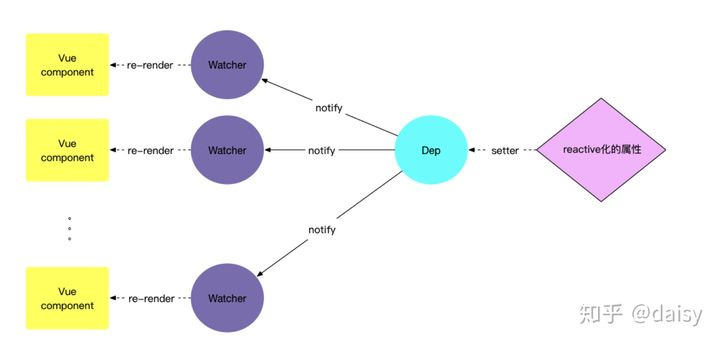
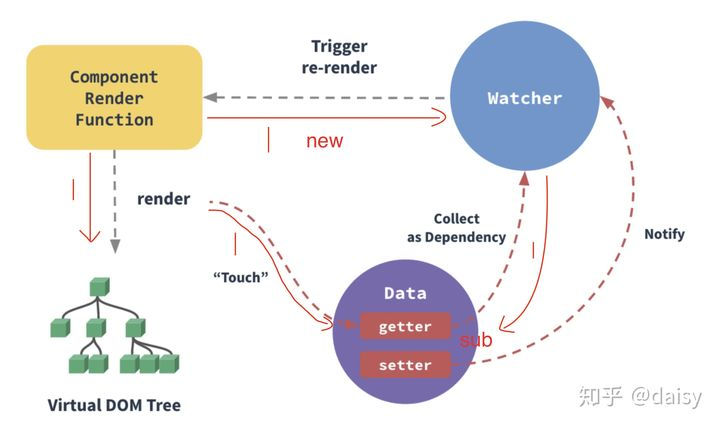

# vue2简单响应式原理

**1、init 阶段：** VUE 的 data的属性都会被reactive化，也就是加上 setter/getter函数。

```js
function defineReactive(obj: Object, key: string, ...) {
    const dep = new Dep()

    Object.defineProperty(obj, key, {
      enumerable: true,
      configurable: true,
      get: function reactiveGetter () {
        ....
        dep.depend()
        return value
        ....
      },
      set: function reactiveSetter (newVal) {
        ...
        val = newVal
        dep.notify()
        ...
      }
    })
  }
  
  class Dep {
      static target: ?Watcher;
      subs: Array<Watcher>;

      depend () {
        if (Dep.target) {
          Dep.target.addDep(this)
        }
      }

      notify () {
        const subs = this.subs.slice()
        for (let i = 0, l = subs.length; i < l; i++) {
          subs[i].update()
        }
      }
}
```

其中这里的Dep就是一个调度中心（发布者），每一个data的属性都会有一个dep对象。当getter调用的时候，去dep里注册函数，

setter的时候，就是去通知执行刚刚注册的函数。

**2、mount 阶段：**

```js
mountComponent(vm: Component, el: ?Element, ...) {
    vm.$el = el

    ...

    updateComponent = () => {
      //render生成虚拟dom，update生成渲染真实dom
      vm._update(vm._render(), ...)
    }

    new Watcher(vm, updateComponent, ...)
    ...
}


class Watcher {
  getter: Function;

  // 代码经过简化
  constructor(vm: Component, expOrFn: string | Function, ...) {
    ...
    this.getter = expOrFn
    Dep.target = this                      // 注意这里将当前的Watcher赋值给了Dep.target
    this.value = this.getter.call(vm, vm)  // 调用组件的更新函数
    ...
  }
}
```

mount 阶段的时候，会创建一个Watcher类的对象。这个Watcher实际上是连接Vue组件与Dep的桥梁（观察者、订阅者）。
每一个Watcher对应一个vue component。

这里可以看出new Watcher的时候，constructor 里的this.getter.call(vm, vm)函数会被执行。getter就是updateComponent。这个函数会调用组件的render函数来更新重新渲染。

而render函数里，会访问data的属性，比如

```js
render: function (createElement) {
  return createElement('h1', this.blogTitle)
}
```

此时会去调用这个属性blogTitle的getter函数，即：

```js
// getter函数
get: function reactiveGetter () {
    ....
    dep.depend()
    return value
    ....
 },
// dep的depend函数
depend () {
    if (Dep.target) {
      Dep.target.addDep(this)
    }
}
```

在depend的函数里，Dep.target就是watcher本身（我们在class Watch里讲过，不记得可以往上第三段代码），这里做的事情就是给blogTitle注册了Watcher这个对象。这样每次render一个vue 组件的时候，如果这个组件用到了blogTitle，那么这个组件相对应的Watcher对象都会被注册到blogTitle的Dep中。

这个过程就叫做**依赖收集**。

收集完所有依赖blogTitle属性的组件所对应的Watcher之后，当它发生改变的时候，就会去通知Watcher更新关联的组件。

**3、更新阶段：**

当blogTitle 发生改变的时候，就去调用Dep的notify函数,然后通知所有的Watcher调用update函数更新。

```js
notify () {
    const subs = this.subs.slice()
    for (let i = 0, l = subs.length; i < l; i++) {
      subs[i].update()
    }
}
```

可以用一张图来表示：



由此图我们可以看出Watcher是连接VUE component 跟 data属性的桥梁。

### 总结

最后，我们通过解释官方的图来做个总结。



**1、第一步：**组件初始化的时候（**new Vue时执行的this._init(options)**），先给每一个Data属性都注册getter，setter（**observe方法执行的defineReactive**），也就是reactive化。在$mount（**执行mountComponent方法**）之后然后再new 一个自己的Watcher对象（**new Watcher**），此时watcher会立即调用组件的render函数去生成虚拟DOM（**updateComponent方法里面的vm.\_update(vm.\_render(), hydrating)**）。在调用render的时候，就会需要用到data的属性值，此时会触发getter函数，将当前的Watcher函数注册进sub里（**Watcher的addDep方法中的dep.addSub(this)**）。

**2、第二步：**当data属性发生改变之后，就会遍历sub里所有的watcher对象（**Dep的notify方法**），通知它们去重新渲染组件（**Watcher的update方法最终执行updateComponent方法**），_update中有patch方法，这个方法是比对虚拟dom，也就是diff。
